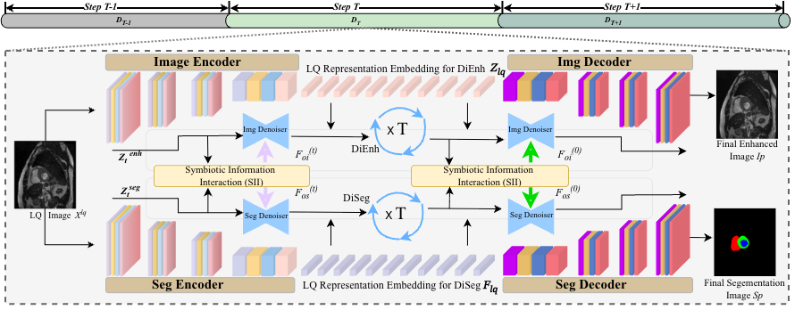

# DiSIINet: Joint Medical Image Enhancement and Segmentation with Diffusion-based Symbiotic Information Interaction



Official PyTorch implementation of **Joint Medical Image Enhancement and Segmentation with Diffusion-based Symbiotic Information Interaction** (IJCAI-ECAI 2026).

> Joint Enhancement-Segmentation via Cross-Task Interaction in Latent Diffusion

## Overview

DiSIINet is a dual-branch DDIM framework that jointly performs medical image enhancement (DiEnh) and segmentation (DiSeg). The two branches interact through a **Symbiotic Information Interaction (SII)** module with bidirectional cross-attention during the reverse diffusion process.

```
                    ┌─────────────┐
  LQ Image ────────►│   DiEnh     │──────► Enhanced Image
                    │  (DDIM)     │
                    └──────┬──────┘
                           │ SII Module
                    ┌──────┴──────┐
  LQ Image ────────►│   DiSeg     │──────► Segmentation Mask
                    │  (DDIM)     │
                    └─────────────┘
```

## Features

- Dual DDIM branches for joint enhancement and segmentation
- SII module with Enh-Controller and Seg-Controller (multi-head cross-attention)
- Cosine noise schedule, T=1000 training steps, S=50 inference steps
- Support for ACDC (MRI), KiTS19 (CT), and TN3K (ultrasound) datasets

## Installation

推荐使用 **Python 3.10**（conda 环境 `py310`）：

```bash
cd DiSIINet
conda activate py310          # 或: bash setup_env.sh
pip install -r requirements.txt
```

若尚未创建环境：

```bash
conda create -n py310 python=3.10 pip -y
conda activate py310
pip install -r requirements.txt
```

Requirements: Python 3.10, PyTorch 2.0+, CUDA recommended.

## Project Structure

```
DiSIINet/
├── configs/           # Dataset-specific configs (acdc, kits19, tn3k)
├── disiinet/
│   ├── models/        # DiSIINet, UNet, VAE, SII
│   ├── diffusion/       # DDIM schedule and sampling
│   ├── losses/        # Joint training loss
│   ├── data/          # Dataset loaders
│   └── utils/         # Metrics and helpers
├── scripts/           # Data preparation utilities
├── train.py           # Training script
├── inference.py       # Inference and evaluation
└── requirements.txt
```

## Data Preparation

Organize datasets with the following structure:

```
data/ACDC/
├── images/       # HQ images (.png)
├── masks/        # Segmentation masks (.png)
├── train.txt     # Sample names (one per line)
├── val.txt
└── test.txt
```

Low-quality images are generated on-the-fly via bicubic downsampling (STS-SR degradation).

生成分割列表：

```bash
python scripts/prepare_splits.py --root ./data/ACDC
python scripts/prepare_splits.py --root ./data/KiTS19
python scripts/prepare_splits.py --root ./data/TN3K
```

### Supported Datasets

| Dataset | Modality   | Size    | Classes |
|---------|------------|---------|---------|
| ACDC    | MRI        | 320×320 | 4       |
| KiTS19  | CT         | 320×320 | 3       |
| TN3K    | Ultrasound | 256×256 | 2       |

### Demo Data (Smoke Test)

```bash
conda activate py310
python scripts/prepare_demo_data.py --output ./data/demo --size 128 --num_samples 20
python train.py --config configs/demo.yaml
python inference.py --config configs/demo.yaml --checkpoint outputs/demo/checkpoint_final.pth --split test --save_vis
```

## Training

```bash
# ACDC (MRI)
python train.py --config configs/acdc.yaml

# KiTS19 (CT)
python train.py --config configs/kits19.yaml

# TN3K (Ultrasound)
python train.py --config configs/tn3k.yaml

# Resume from checkpoint
python train.py --config configs/acdc.yaml --resume outputs/acdc/checkpoint_epoch_50.pth
```

### Training Settings (from paper)

- Optimizer: AdamW, lr=1e-4, batch size=32
- Loss: L = L_DDIM_DiEnh + β·L_DDIM_DiSeg + L_enh + λ·L_seg (β=1.0, λ=0.5)
- Diffusion: T=1000 train steps, S=50 inference steps, cosine schedule
- SII applied at all sampling steps

## Inference

```bash
python inference.py \
    --config configs/acdc.yaml \
    --checkpoint outputs/acdc/checkpoint_final.pth \
    --split test \
    --save_vis
```

Metrics (PSNR, SSIM, Dice, mIoU) are saved to `results/<dataset>/metrics.txt`.

## Citation

```bibtex
@inproceedings{chen2026disiinet,
  title={Joint Medical Image Enhancement and Segmentation with Diffusion-based Symbiotic Information Interaction},
  author={Chen, Ying and Li, Jinyue and Li, Qiankun},
  booktitle={IJCAI-ECAI},
  year={2026}
}
```

## License

This project is for research purposes. Please cite the paper if you use this code.
